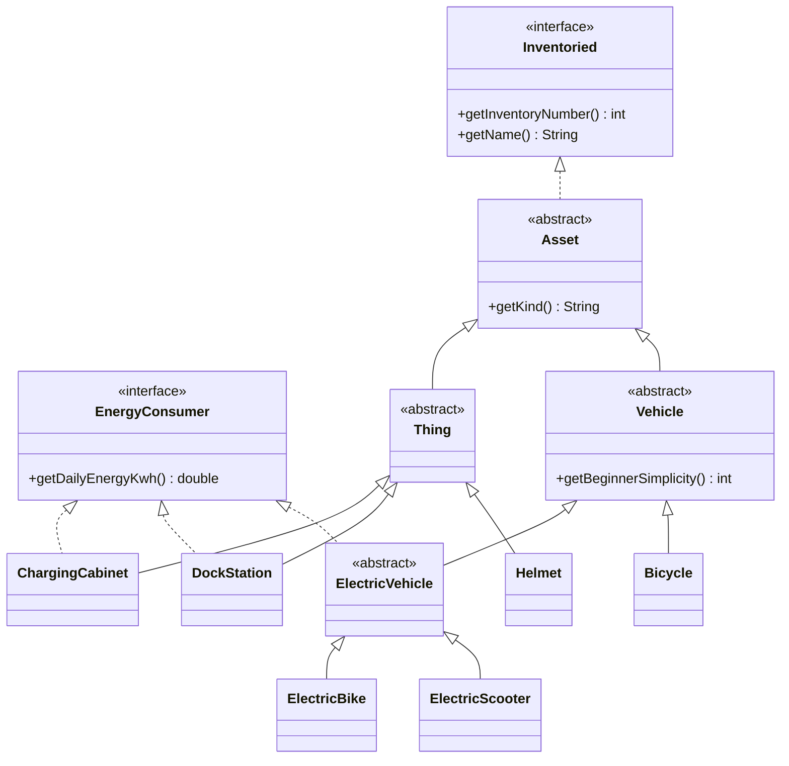
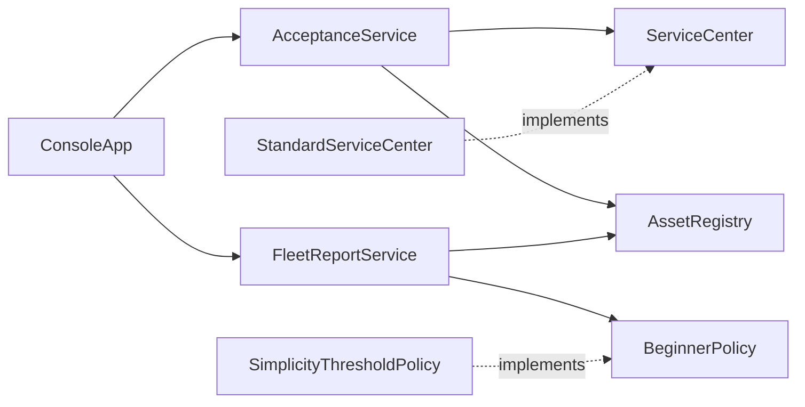

# ВышКат — учёт парка кикшеринга

> «Доедем до дедлайна». Домашнее задание №1 по КПО: доменная модель, SOLID, DI-контейнер, юнит-тесты.

Модуль `modules/hw-1` репозитория курса. Консольное приложение на Java 25 + Spring Context (DI-контейнер). Умеет:

| Требование | Где в приложении |
|---|---|
| 1. Добавление транспорта в парк | меню «1. Принять транспорт» → [`AcceptanceService.acceptVehicle`](src/main/java/ru/hse/vyshkat/fleet/AcceptanceService.java) |
| 2. Техосмотр перед приёмкой (принять / отклонить) | [`ServiceCenter`](src/main/java/ru/hse/vyshkat/inspection/ServiceCenter.java), реализация [`StandardServiceCenter`](src/main/java/ru/hse/vyshkat/inspection/StandardServiceCenter.java) |
| 3. Суммарное суточное потребление энергии | меню «4» → [`FleetReportService.energyReport`](src/main/java/ru/hse/vyshkat/fleet/FleetReportService.java) |
| 4. Список устройств для новичков (простота ≥ 6) | меню «5» → [`BeginnerPolicy`](src/main/java/ru/hse/vyshkat/fleet/BeginnerPolicy.java) / [`SimplicityThresholdPolicy`](src/main/java/ru/hse/vyshkat/fleet/SimplicityThresholdPolicy.java) |
| 5. Вещи на балансе + инвентарные номера вместе с техникой | меню «2» и «6» → [`AssetRegistry`](src/main/java/ru/hse/vyshkat/fleet/AssetRegistry.java) |
| Отчёт по числу единиц | меню «3» → `FleetReportService.summary` |
| 6. Демонстрация всех сценариев | `--demo`: [`demo-script.txt`](src/main/resources/demo-script.txt) |

## Запуск

Команды выполняются из корня репозитория. Нужен только JDK 25: Gradle скачает wrapper сам.

```bash
./gradlew :modules:hw-1:check                                    # тесты + checkstyle (Sun) + покрытие ≥ 60%
./gradlew -q --console=plain :modules:hw-1:run --args="--demo"   # демо-сценарий со всеми ветками
```

Интерактивное меню удобнее запускать готовым скриптом: так вывод Gradle не смешивается с диалогом.

```bash
./gradlew -q :modules:hw-1:installDist
modules/hw-1/build/install/hw-1/bin/hw-1            # интерактивно
modules/hw-1/build/install/hw-1/bin/hw-1 --demo     # демо
```

Отчёты после `check`:
- покрытие — `modules/hw-1/build/reports/jacoco/test/html/index.html`;
- checkstyle — `modules/hw-1/build/reports/checkstyle/main.html` и `test.html`.

### Что показывает демо

Демо прогоняет то же меню, что и интерактивный режим, но ввод берётся из файла и печатается — получается запись сеанса оператора:

1. пустая ведомость → «Баланс пуст»;
2. электросамокат с нормальным расходом → **принят**;
3. электровелосипед (простота 5) → принят, но **не** попадает в список для новичков; по пути — ввод `abc` вместо числа → повторный запрос;
4. велосипед → принят без вопроса про энергию; простота `15` → повторный запрос;
5. электросамокат с расходом 3.2 кВт·ч → **отклонён техосмотром** с причиной;
6. велосипед с занятым номером `1001` → **отказ**, техосмотр не проводится;
7. шлем, док-станция, зарядный шкаф → на балансе без техосмотра; отрицательный расход → повторный запрос;
8. все четыре отчёта; неверный пункт меню; выход.

Фрагмент вывода:

```
--- Суточное энергопотребление ---
Транспорт:    1.50 кВт·ч
Оборудование: 5.70 кВт·ч
Итого:        7.20 кВт·ч

--- Транспорт для новичков (простота для новичка ≥ 6) ---
  Электросамокат «Ninebot Max G30», инв. № 1001, простота 8
  Велосипед «Stels Navigator 300», инв. № 1003, простота 9

--- Инвентарная ведомость ---
  № 1001   Электросамокат    Ninebot Max G30
  № 1002   Электровелосипед  Eltreco XT 600
  № 1003   Велосипед         Stels Navigator 300
  № 2001   Шлем              Cairn Prism, размер M
  № 2002   Док-станция       Покровский бульвар, 11
  № 2003   Зарядный шкаф     Склад на Мясницкой, 16 АКБ
```

## Архитектура

### Модули (пакеты)

| Пакет | Ответственность | Зависит от |
|---|---|---|
| [`domain`](src/main/java/ru/hse/vyshkat/domain) | что стоит на балансе: иерархия транспорта и вещей, интерфейсы `Inventoried`, `EnergyConsumer` | ни от чего (и от Spring тоже) |
| [`inspection`](src/main/java/ru/hse/vyshkat/inspection) | техосмотр: `ServiceCenter`, `InspectionResult` | `domain` |
| [`fleet`](src/main/java/ru/hse/vyshkat/fleet) | баланс, приёмка, отчёты, правило для новичков | `domain`, `inspection` |
| [`console`](src/main/java/ru/hse/vyshkat/console) | диалог с оператором и форматирование вывода | `fleet` |
| [`config`](src/main/java/ru/hse/vyshkat/config) | сборка графа объектов в DI-контейнере | все |

Зависимости направлены внутрь, к домену: домен ничего не знает о сервисах, сервисы — о консоли, никто кроме `config` и `Main` — о Spring.

### Доменная модель



### Сервисы и DI



Все объекты создаёт контейнер Spring по конфигурации [`FleetConfig`](src/main/java/ru/hse/vyshkat/config/FleetConfig.java) (бизнес-логика) и [`ConsoleConfig`](src/main/java/ru/hse/vyshkat/config/ConsoleConfig.java) (консоль). Каждый бин — синглтон, поэтому приёмка и отчёты работают с одним и тем же `AssetRegistry`.

## Логика решений

1. **Две независимые оси: «что это» и «что умеет».** Класс отвечает на вопрос «что это» (транспорт или вещь), интерфейс — «что умеет» (имеет инвентарный номер, потребляет энергию). Оси не совпадают: велосипед — транспорт без энергии, док-станция — вещь с энергией. Поэтому энергия — интерфейс [`EnergyConsumer`](src/main/java/ru/hse/vyshkat/domain/EnergyConsumer.java), а не поле в базовом классе, и велосипеду не приходится «потреблять 0 кВт·ч».
2. **Тип определяет путь приёмки.** `acceptVehicle(Vehicle)` всегда идёт через техосмотр, `acceptThing(Thing)` — сразу на баланс. Провести самокат мимо техосмотра нельзя: компилятор не даст передать `Vehicle` в `acceptThing`.
3. **Сотрудники — не `Asset`.** По условию на баланс ставятся только транспорт и вещи, поэтому общий предок [`Asset`](src/main/java/ru/hse/vyshkat/domain/Asset.java) реализует `Inventoried`, а будущий сотрудник его просто не наследует.
4. **Техосмотр — абстракция с одной штатной реализацией.** [`StandardServiceCenter`](src/main/java/ru/hse/vyshkat/inspection/StandardServiceCenter.java) отклоняет электротранспорт, у которого суточный расход выше нормы (1.5 кВт·ч, задаётся в `FleetConfig`): такой расход означает неисправную батарею или контроллер. Решение возвращается как [`InspectionResult`](src/main/java/ru/hse/vyshkat/inspection/InspectionResult.java) с причиной, чтобы оператор видел, *почему* отказали.
5. **Правило для новичков вынесено из отчётов.** Заказчик прямо пишет, что правило будут усложнять, поэтому [`FleetReportService`](src/main/java/ru/hse/vyshkat/fleet/FleetReportService.java) спрашивает [`BeginnerPolicy`](src/main/java/ru/hse/vyshkat/fleet/BeginnerPolicy.java), а не сравнивает с 6 сам.
6. **Инварианты — в конструкторах.** Пустое наименование, номер ≤ 0, простота вне 1–10, неположительный расход дают `IllegalArgumentException` ([`Checks`](src/main/java/ru/hse/vyshkat/domain/Checks.java)). Объекты неизменяемы. Консоль заранее проверяет ввод и переспрашивает, поэтому до исключений дело не доходит, а ошибки ввода не роняют программу.
7. **Инвентарный номер уникален.** Его вводит оператор (номер на наклейке), а `AssetRegistry` отклоняет дубликат. `AcceptanceService` проверяет номер *до* техосмотра, чтобы не гонять технику на осмотр зря.
8. **Консоль без бизнес-логики.** [`ConsoleApp`](src/main/java/ru/hse/vyshkat/console/ConsoleApp.java) только спрашивает и печатает. Ввод-вывод вынесен в [`ConsoleIO`](src/main/java/ru/hse/vyshkat/console/ConsoleIO.java): так меню тестируется подачей строки, а демо-режим переиспользует то же меню с эхо-печатью ввода.

## SOLID

| Принцип | Где и как |
|---|---|
| **S** — единственная ответственность | `AssetRegistry` хранит, `AcceptanceService` принимает, `FleetReportService` считает отчёты, `ConsoleApp` ведёт диалог, `ConsoleIO` читает и пишет, `FleetConfig` собирает граф. У каждого класса ровно одна причина для изменения: например, смена формата вывода трогает только `ConsoleApp`. |
| **O** — открыт для расширения, закрыт для изменения | Новый вид транспорта — новый класс; сервисы, техосмотр и отчёты не меняются: отчёты группируют по полиморфному `getKind()`, энергию собирают через `EnergyConsumer`. Новое правило для новичков — новая реализация `BeginnerPolicy` и одна строка в `FleetConfig`. |
| **L** — подстановка Лисков | Любой наследник `Vehicle` корректно проходит техосмотр и отчёты. Подклассы не ослабляют контракт: велосипед не реализует `EnergyConsumer` «заглушкой» с нулём и не бросает `UnsupportedOperationException`. |
| **I** — разделение интерфейсов | `Inventoried` и `EnergyConsumer` маленькие и независимые: шлему не навязан расход энергии. `ServiceCenter` — один метод. `AssetRegistry.findAllOf(EnergyConsumer.class)` позволяет потребителю зависеть только от нужной возможности. |
| **D** — инверсия зависимостей | `AcceptanceService` зависит от интерфейса `ServiceCenter`, `FleetReportService` — от `BeginnerPolicy`. Реализации выбираются в одном месте — `FleetConfig` — и внедряются через конструктор. Домен и сервисы не знают о Spring. |

### DI-контейнер

Используется **Spring Context** (без Spring Boot: для консольного приложения автоконфигурация и веб-стек не нужны).

- Бины объявлены явно через `@Configuration` + `@Bean`, а не через `@Component`-сканирование. Так доменные классы не зависят от фреймворка, а вся сборка графа видна в одном файле.
- `proxyBeanMethods = false`: `@Bean`-методы не вызывают друг друга, зависимости приходят параметрами, и CGLIB-прокси конфигурации не нужен.
- Источник ввода зависит от режима запуска, поэтому [`Main`](src/main/java/ru/hse/vyshkat/Main.java) регистрирует бин `ConsoleIO` вручную (`registerBean`) перед `refresh()`.

## Тесты

62 теста (JUnit 6, Mockito, spring-test), у каждого есть `@DisplayName` на русском. Покрытие строк — около 98% (JaCoCo). Порог 60% проверяется задачей `jacocoTestCoverageVerification` внутри `check`, и сборка падает, если покрытие ниже.

| Тест | Что фиксирует |
|---|---|
| [`AssetTest`](src/test/java/ru/hse/vyshkat/domain/AssetTest.java) | инварианты конструкторов, кто является `EnergyConsumer`, виды |
| [`StandardServiceCenterTest`](src/test/java/ru/hse/vyshkat/inspection/StandardServiceCenterTest.java) | штатный техосмотр: норма, граница, причина отказа |
| [`AcceptanceServiceTest`](src/test/java/ru/hse/vyshkat/fleet/AcceptanceServiceTest.java) | приёмка с **подменой `ServiceCenter` через конструктор** (стабы-лямбды и Mockito-мок) |
| [`ServiceCenterMockBeanTest`](src/test/java/ru/hse/vyshkat/config/ServiceCenterMockBeanTest.java) | **подмена `ServiceCenter` в DI-контейнере** через `@MockitoBean` |
| [`FleetConfigTest`](src/test/java/ru/hse/vyshkat/config/FleetConfigTest.java) | боевая конфигурация: штатный техосмотр, общий баланс у приёмки и отчётов |
| [`SimplicityThresholdPolicyTest`](src/test/java/ru/hse/vyshkat/fleet/SimplicityThresholdPolicyTest.java) | правило «для новичков»: 5 — нет, 6 — да, настраиваемый порог |
| [`FleetReportServiceTest`](src/test/java/ru/hse/vyshkat/fleet/FleetReportServiceTest.java) | подсчёт единиц, энергии, список для новичков, ведомость, пустой парк |
| [`AssetRegistryTest`](src/test/java/ru/hse/vyshkat/fleet/AssetRegistryTest.java) | уникальность номеров, сортировка, поиск по классу и интерфейсу |
| [`ConsoleAppTest`](src/test/java/ru/hse/vyshkat/console/ConsoleAppTest.java) | сценарии меню, повторный запрос при ошибке ввода, конец ввода |
| [`MainTest`](src/test/java/ru/hse/vyshkat/MainTest.java) | полный запуск через контейнер: демо и интерактивный режим |

## Обязательные вопросы

### Какой принцип SOLID применён наиболее явно и где?

**DIP.** [`AcceptanceService`](src/main/java/ru/hse/vyshkat/fleet/AcceptanceService.java) получает `ServiceCenter` через конструктор и не знает, кто проводит техосмотр. Конкретный [`StandardServiceCenter`](src/main/java/ru/hse/vyshkat/inspection/StandardServiceCenter.java) выбирается только в [`FleetConfig`](src/main/java/ru/hse/vyshkat/config/FleetConfig.java). В тестах на его место подставляются стабы и моки, и сама приёмка при этом не меняется. По той же схеме устроена пара `FleetReportService` → `BeginnerPolicy`.

### Какой принцип сознательно ограничен и почему это приемлемо?

**OCP — в консольных каталогах** [`VehicleKind`](src/main/java/ru/hse/vyshkat/console/VehicleKind.java) и [`ThingKind`](src/main/java/ru/hse/vyshkat/console/ThingKind.java). Чтобы новый вид техники появился в меню, нужно добавить в enum одну строку: имя, нужен ли вопрос про энергию, конструктор. Можно было бы собирать список видов из контейнера, по бину-фабрике на каждый вид, но для трёх видов транспорта это лишние классы ради одной строки. Правка локальна и находится на краю системы (UI), а домен, техосмотр и отчёты остаются закрытыми. То же относится к `switch` в меню `ConsoleApp`.

**DIP — для `AssetRegistry`.** Хранилище — конкретный класс без интерфейса: реализация одна (в памяти), и подменять её в тестах не нужно, потому что она быстрая и детерминированная. Интерфейс без второй реализации был бы «декоративным» SOLID. Когда появится БД, интерфейс выделяется за минуты: `AssetRegistry` создаётся только в `FleetConfig`.

### Что сломается (или не сломается) при расширении?

- **Новый вид транспорта (например, моноколесо).** Нужен класс `Monowheel extends ElectricVehicle` и строка в `VehicleKind`. Больше ничего не меняется: техосмотр проверит расход через `EnergyConsumer`, отчёты посчитают моноколесо по `getKind()`, правило для новичков возьмёт `getBeginnerSimplicity()`. Существующие тесты не трогаются.
- **Сотрудник службы эксплуатации.** Это не `Asset` и не `Inventoried`, поэтому он не попадёт ни в ведомость, ни в отчёт по энергии — система такое и запрещает. Нужен отдельный пакет `staff` (класс `Employee`, своё хранилище). Текущий код не меняется.
- **Склад запчастей.** Если запчасть учитывается поштучно, это `SparePart extends Thing` плюс строка в `ThingKind`: номер и ведомость работают сразу. Если запчасти учитываются количеством (100 болтов под одним артикулом), понадобится новая абстракция «складская позиция», потому что `Inventoried` описывает уникальную единицу. Это будет новый модуль рядом с `fleet`, без правок существующего.
- **Что сломается.** Если техосмотр понадобится и вещам (например, электробезопасность зарядных шкафов), придётся обобщить сигнатуру `ServiceCenter.inspect(Vehicle)` до `Asset`. Это осознанный компромисс: сейчас по требованиям техосмотр проходит только транспорт.

### Какой тест фиксирует решение техосмотра и правило «для новичков»? Как подменяется зависимость?

- **Решение техосмотра:** [`AcceptanceServiceTest`](src/test/java/ru/hse/vyshkat/fleet/AcceptanceServiceTest.java). Стабы-лямбды `ALWAYS_PASS` и `ALWAYS_FAIL` передаются в конструктор `AcceptanceService` вместо `StandardServiceCenter`. Тесты проверяют, что отклонённое устройство не попадает на баланс, принятое — попадает. Mockito-мок проверяет, что при занятом номере техосмотр не вызывается (`verifyNoInteractions`), а вещи принимаются без него.
- **Подмена в DI-контейнере:** [`ServiceCenterMockBeanTest`](src/test/java/ru/hse/vyshkat/config/ServiceCenterMockBeanTest.java). `@MockitoBean` заменяет бин `ServiceCenter` в контексте Spring, и контейнер сам внедряет мок в `AcceptanceService`. Мок отклоняет исправный самокат и пропускает неисправный — то есть решение действительно принимает подменённая зависимость.
- **Штатные правила:** [`StandardServiceCenterTest`](src/test/java/ru/hse/vyshkat/inspection/StandardServiceCenterTest.java) — норма расхода и граница.
- **Правило «для новичков»:** [`SimplicityThresholdPolicyTest`](src/test/java/ru/hse/vyshkat/fleet/SimplicityThresholdPolicyTest.java) — параметризованный тест, где 5 → нет, 6 → да. В [`FleetReportServiceTest`](src/test/java/ru/hse/vyshkat/fleet/FleetReportServiceTest.java) проверено, что отчёт следует внедрённой политике: подставлена политика «только велосипеды», и `FleetReportService` при этом не менялся.

### Что сделал ИИ, а что изменил я?

**ИИ.** Использовался ассистент Claude Code (модель Claude Opus 5.5). По тексту задания и моим требованиям он:

- предложил архитектуру, иерархию классов и разбиение на пакеты;
- написал черновое решение: код, тесты, демо-сценарий, Gradle-модуль и этот README;
- объяснил мне решение и тонкости Java.

**Я.** Разобрался в решении. Ошибок, которые бы повлияли на работу программы, найдено не было. Однако решение оказалось чересчур громоздким, поэтому:

- удалил 8 файлов `package-info.java` — описания пакетов, которых checkstyle не требует;
- удалил тест `ServiceCenterTestBeanTest` (60 строк). Он через `@TestBean` подменял техосмотр фейком «принимаем только велосипеды» и дублировал `AcceptanceServiceTest` и `ServiceCenterMockBeanTest`;
- проверил, что `./gradlew :modules:hw-1:check` проходит: 62 теста зелёные, покрытие строк ~98% (не изменилось), нарушений checkstyle — 0.

## Code style

- Checkstyle 14.1.0 со встроенной конфигурацией **Sun Code Conventions**, настроенной как в `practise-4`: без правил `JavadocPackage` и `JavadocVariable`, `maxWarnings = 0`. Проверяются и основной код, и тесты, в обоих случаях 0 нарушений.
- Из этого следуют строки до 80 символов, `final`-параметры, Javadoc с `@param`/`@return` у публичных методов, именованные константы вместо «магических чисел». Имена параметров конструктора отличаются от полей (правило `HiddenField`).
- Поля `final`, объекты домена неизменяемы, коллекции наружу отдаются только для чтения. Классы, не предназначенные для наследования, объявлены `final`.
- Строки интерфейса на русском, идентификаторы на английском. Числа форматируются с `Locale.ROOT`, чтобы вывод не зависел от локали машины.
